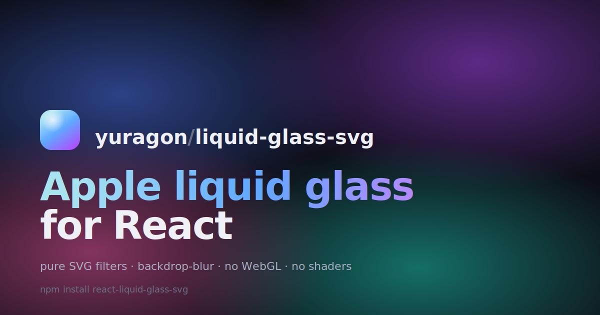
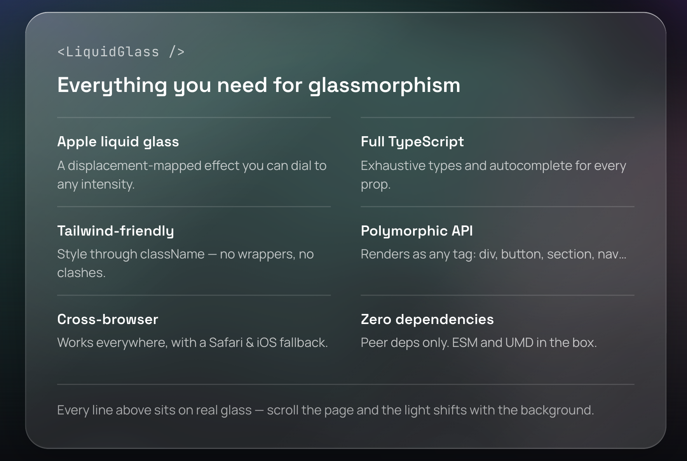
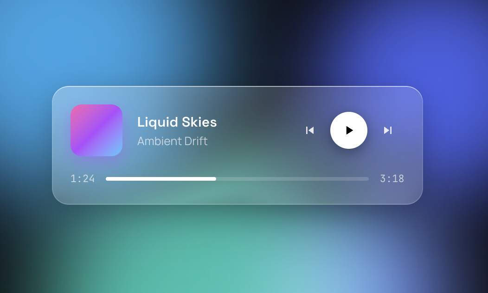
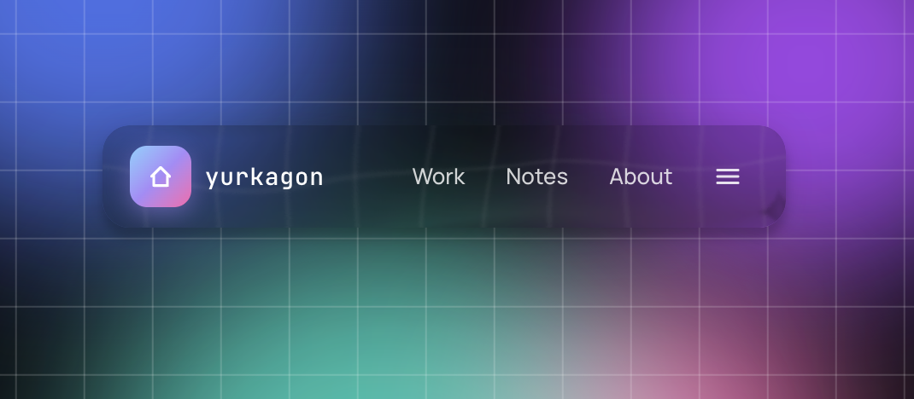
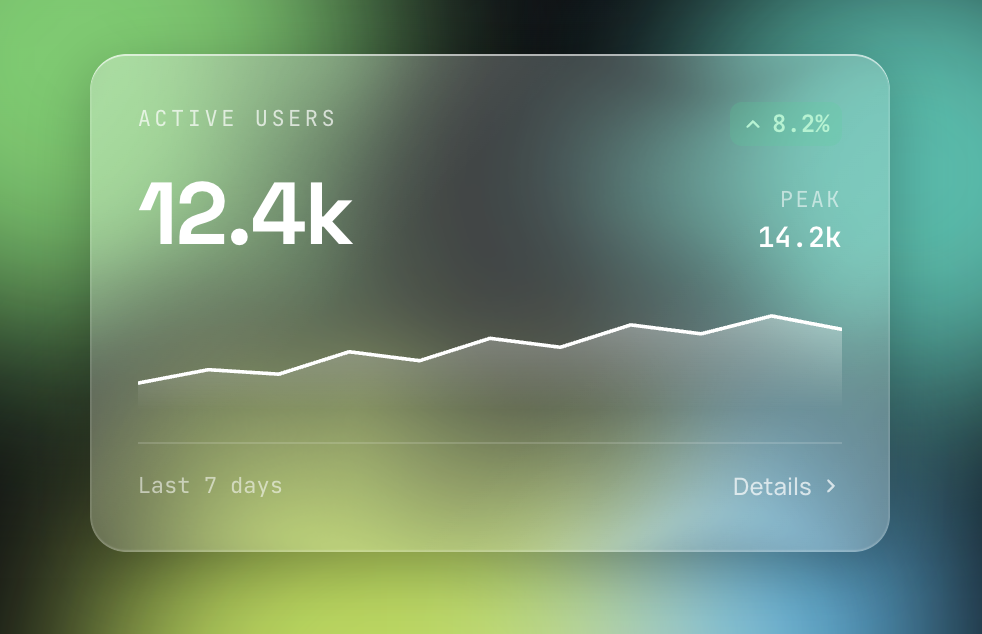
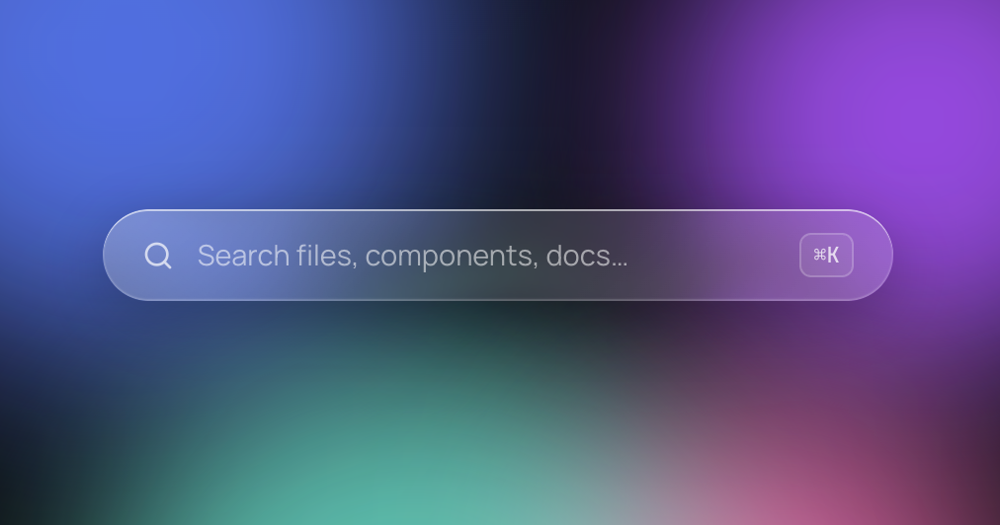

<div align="center">



# `react-liquid-glass-svg`

### Apple liquid glass for React — pure SVG, zero shaders.

[](https://www.npmjs.com/package/react-liquid-glass-svg)
[](https://bundlephobia.com/package/react-liquid-glass-svg)
[](https://www.npmjs.com/package/react-liquid-glass-svg)
[](./LICENSE)

[**✨ Live demo**](https://yurkagon.github.io/react-liquid-glass-svg/) · [**Examples**](#-examples) · [**Playground**](https://yurkagon.github.io/react-liquid-glass-svg/#sandbox) · [**API**](#-api)

</div>

<div align="center">
  
</div>

---

## 🚀 Why this and not the others?

Most glass-effect packages rely on WebGL or canvas — heavy, SSR-hostile, and awkward inside normal DOM layouts. This one uses plain SVG filters (`feTurbulence` + `feDisplacementMap`) — no shaders, no heavy runtimes:

```
  <feTurbulence>          ← organic noise
        ↓
  <feDisplacementMap>     ← warps pixels by the noise
        ↓
  backdrop-filter: blur() ← softens the result
```

That's the entire trick. **No shaders. No canvas. No WebGL.** ~2 KB gzip.

## ✨ Features

|                            |                                                                                         |
| -------------------------- | --------------------------------------------------------------------------------------- |
| 🪟 **Apple liquid glass**  | Real displacement-mapped refraction on Chromium/Firefox; noise+blur fallback on Safari. |
| ⚡ **~2 KB gzipped**       | One file, zero runtime deps. Tree-shakable, `sideEffects: false`.                       |
| 🧩 **Polymorphic API**     | `<LiquidGlass as="button" />`, `as="nav"`, `as="article"` — semantics stay yours.       |
| 🎨 **Tailwind-friendly**   | Pass `className`. No clashes, no wrappers, no `!important` wars.                        |
| 🔠 **TypeScript-first**    | Strict types, autocompleted props. Zero `@types/*` packages to install.                 |
| 🌐 **Cross-browser**       | Full filter on Chromium/Firefox, graceful Safari/iOS fallback — automatic.              |
| 🔮 **Next.js / SSR ready** | `'use client'` baked in, hydration-safe by design. Zero config.                         |
| 🍎 **iOS glass border**    | Opt-in inset highlights + specular sheen via `glassBorder` prop.                        |

## 📦 Install

```bash
npm install react-liquid-glass-svg
# or
pnpm add react-liquid-glass-svg
# or
yarn add react-liquid-glass-svg
```

Peer deps: `react@>=18`, `react-dom@>=18`.

## 🎬 Quick start

```tsx
import { LiquidGlass } from 'react-liquid-glass-svg';

export default function Card() {
  return (
    <LiquidGlass
      glassBorder
      backdropBlur={5}
      tintColor="rgba(255,255,255,0.2)"
      className="rounded-2xl p-6"
    >
      <h2>Hello, glass</h2>
      <p>This card refracts whatever sits behind it.</p>
    </LiquidGlass>
  );
}
```

Drop a colorful background behind it — gradient, image, video — and you'll see real refraction along the edges. 🌈

## 🧪 Examples

> All four examples below are live in the [**demo**](https://yurkagon.github.io/react-liquid-glass-svg/#examples) — drag the playground sliders, swap the prismatic backgrounds, copy the result.

### 🎵 Music Player



```tsx
<LiquidGlass
  glassBorder
  backdropBlur={5}
  tintColor="rgba(255,255,255,0.15)"
  className="w-[360px] rounded-2xl p-5"
>
  <div className="flex items-center gap-4">
    <AlbumArt />
    <TrackMeta />
    <PlayControls />
  </div>
  <ProgressBar value={42} />
</LiquidGlass>
```

### 🧭 Header (polymorphic)



```tsx
<LiquidGlass
  as="header" // <header> instead of <div>
  backdropBlur={1.2}
  tintColor="rgba(0,0,0,0.2)"
  displacementScale={60}
  turbulenceSeed={1}
  className="flex h-16 items-center justify-between rounded-2xl px-6"
>
  <a href="/" className="flex items-center gap-2">
    <Logo />
    <span>yurkagon</span>
  </a>
  <div className="flex items-center gap-4">
    <a href="/work">Work</a>
    <a href="/notes">Notes</a>
    <a href="/about">About</a>
    <button aria-label="Open menu">
      <Menu />
    </button>
  </div>
</LiquidGlass>
```

### 📊 Stats card



```tsx
<LiquidGlass
  glassBorder
  backdropBlur={5}
  tintColor="rgba(255,255,255,0.2)"
  className="rounded-2xl p-6"
>
  <Header label="Active users" trend={8.2} />
  <BigNumber value="12.4k" />
  <Sparkline data={[...]} />
  <Footer days={7} />
</LiquidGlass>
```

### 🔍 Search (command palette)



```tsx
<LiquidGlass
  glassBorder
  backdropBlur={6}
  tintColor="rgba(255,255,255,0.12)"
  className="w-[420px] rounded-full px-5 py-3"
>
  <div className="flex items-center gap-3">
    <SearchIcon />
    <input placeholder="Search files…" />
    <kbd>⌘K</kbd>
  </div>
</LiquidGlass>
```

## 🛝 Try it live

Tweak every prop in real time, copy the result:
**→ [yurkagon.github.io/react-liquid-glass-svg/#sandbox](https://yurkagon.github.io/react-liquid-glass-svg/#sandbox)**

## 🧬 How it works

```
┌──────────────────────────────────────────────────┐
│ outer <Tag>  position:relative; overflow:hidden  │
│ ┌──────────────────────────────────────────────┐ │
│ │ z:0  backdrop-filter: blur() + filter: url() │ │ ← noise + displacement
│ ├──────────────────────────────────────────────┤ │
│ │ z:1  tint background                         │ │ ← tintColor
│ ├──────────────────────────────────────────────┤ │
│ │ z:2  sheen overlay (when glassBorder)        │ │ ← gradient + inset shadow
│ ├──────────────────────────────────────────────┤ │
│ │ z:3  content (your children)                 │ │
│ └──────────────────────────────────────────────┘ │
└──────────────────────────────────────────────────┘
```

The SVG filter chain lives in a hidden `<svg>` next to the component and is referenced by a unique id generated via `useId()` — safe for SSR and for many instances on one page.

## 📖 API

```tsx
import { LiquidGlass } from 'react-liquid-glass-svg';
import type { LiquidGlassProps } from 'react-liquid-glass-svg';
```

### Props

| Prop                      | Type                        | Default                     | Description                                                         |
| ------------------------- | --------------------------- | --------------------------- | ------------------------------------------------------------------- |
| `children`                | `ReactNode`                 | —                           | Content rendered inside the glass surface                           |
| `as`                      | `ElementType`               | `'div'`                     | Root element. Use for semantics (`button`, `nav`, …)                |
| `className`               | `string`                    | `''`                        | Applied to the root element                                         |
| `style`                   | `CSSProperties`             | —                           | Merged onto the root element                                        |
| `backdropBlur`            | `number`                    | `2`                         | CSS `backdrop-filter` blur strength, in px                          |
| `tintColor`               | `string`                    | `'rgba(255,255,255,.2)'`    | Overlay color above the blurred backdrop                            |
| `displacementScale`       | `number`                    | `150`                       | `feDisplacementMap` scale. Ignored in the Safari fallback path      |
| `turbulenceBaseFrequency` | `number ∣ [number, number]` | `0.008` or `[0.008, 0.008]` | `feTurbulence` base frequency. Tuple for different x/y              |
| `turbulenceSeed`          | `number`                    | `1.5`                       | `feTurbulence` seed (different patterns)                            |
| `glassBorder`             | `boolean`                   | `false`                     | iOS-style polished edge: inset highlights + diagonal specular sheen |

All other props (`onClick`, `role`, `aria-*`, `data-*`, etc.) are forwarded to the root element. 🎯

## 🔮 Next.js & SSR

The package is built specifically with React Server Components in mind.

The `'use client'` directive is **baked into the published ESM and CJS bundles** — you don't need to add it.

```tsx
// app/page.tsx — Next.js App Router (Server Component)
import { LiquidGlass } from 'react-liquid-glass-svg';

export default function Page() {
  // ✅ Works in a Server Component — package is marked as client
  return (
    <LiquidGlass glassBorder>
      <h1>Hello from the server</h1>
    </LiquidGlass>
  );
}
```

## 🌐 Browser support

| Browser                           | Effect                                                 |
| --------------------------------- | ------------------------------------------------------ |
| Chrome 90+ / Edge 90+ / Opera 76+ | ✅ Full liquid refraction                              |
| Firefox 103+                      | ✅ Full liquid refraction                              |
| Safari 16+ / iOS Safari 16+       | ✨ Simplified fallback (noise + blur, no displacement) |
| Older browsers                    | 🪟 Plain blurred glass — content still readable        |

The fallback path is automatic. The package detects Safari/iOS at runtime and swaps to a filter chain that only uses primitives WebKit supports.

## ⚡ Performance

- **~2 KB gzipped** (ESM build, no peer deps counted)
- **Zero runtime deps**, only React/ReactDOM peer
- **Tree-shakable** (`sideEffects: false`)
- One `<svg>` per instance, no global pollution

## 🛠 Contributing

This is a pnpm monorepo. See [**CONTRIBUTING.md**](./CONTRIBUTING.md) for dev setup, project structure, and commands.

## 📜 License

[MIT](./LICENSE) — free for personal and commercial use. ❤️

---

<div align="center">

Built by **[Yurii Khvyshchuk](https://yuragon.dev)** · [yuragon.dev](https://yuragon.dev) · [@yurkagon](https://github.com/yurkagon)

If you like it, drop a ⭐ on [GitHub](https://github.com/yurkagon/react-liquid-glass-svg).

</div>
